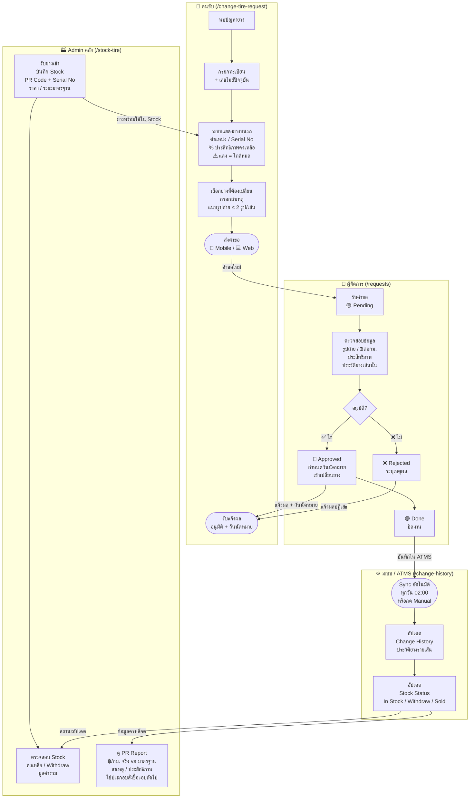

# ระบบจัดการยาง — Swimlane Flow

---

## สรุปบทบาทแต่ละเลน

| เลน | หน้าที่ | หน้าเว็บ |
|-----|---------|---------|
| 🏭 Admin คลัง | รับยาง บันทึก Stock วิเคราะห์ PR Report | `/stock-tire` |
| 🚛 คนขับ | ขอเปลี่ยนยาง แนบรูป รับผลอนุมัติ | `/change-tire-request` |
| 👔 ผู้จัดการ | อนุมัติ/ปฏิเสธ นัดหมาย ปิดงาน | `/requests` |
| ⚙️ ระบบ / ATMS | Sync ข้อมูลอัตโนมัติ อัปเดตประวัติ + สถานะ Stock | `/change-history` |
