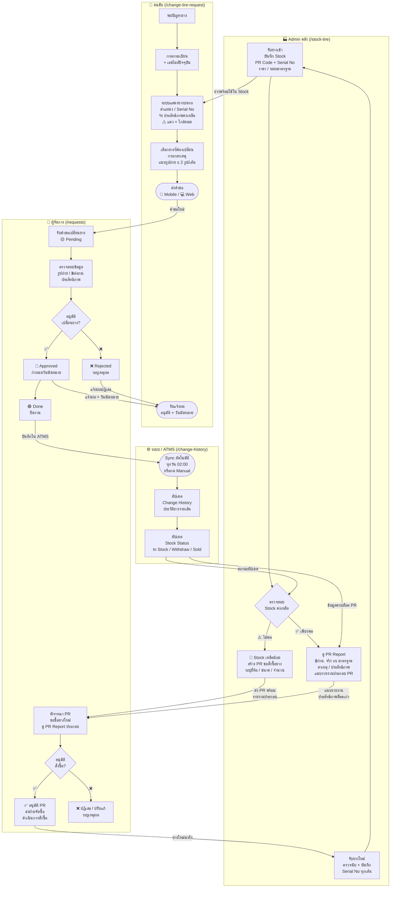

# ระบบจัดการยาง — Swimlane Flow



---

## สรุปบทบาทแต่ละเลน

| เลน | หน้าที่ | หน้าเว็บ |
|-----|---------|---------|
| 🏭 Admin คลัง | รับยาง · บันทึก Stock · ตรวจจับ Stock ต่ำ · สร้าง PR ขอซื้อ | `/stock-tire` |
| 🚛 คนขับ | ขอเปลี่ยนยาง · แนบรูป · รับผลอนุมัติ | `/change-tire-request` |
| 👔 ผู้จัดการ | อนุมัติเปลี่ยนยาง · อนุมัติ PR ขอซื้อยางใหม่ | `/requests` |
| ⚙️ ระบบ / ATMS | Sync อัตโนมัติ · อัปเดตประวัติ + สถานะ Stock | `/change-history` |

---

## จุดเชื่อมต่อ Stock ต่ำ → สั่งซื้อใหม่

```
Stock คงเหลือน้อย
      │
      ▼
Admin ดู PR Report ล็อตเก่า
      │  (฿/กม. / ประสิทธิภาพ / สาเหตุหลัก)
      │  → ใช้เป็นข้อมูลประกอบเลือกยี่ห้อ / รุ่นถัดไป
      ▼
สร้าง PR ขอสั่งซื้อ (แนบรายงานประกอบ)
      │
      ▼
ผู้จัดการพิจารณาอนุมัติ PR
      │
      ▼
ฝ่ายจัดซื้อดำเนินการ → ยางมาถึง
      │
      ▼
Admin รับยาง + บันทึก Serial No ทุกเส้นเข้า Stock
      │
      ▼
ยางพร้อมใช้งาน → วนรอบใหม่
```
